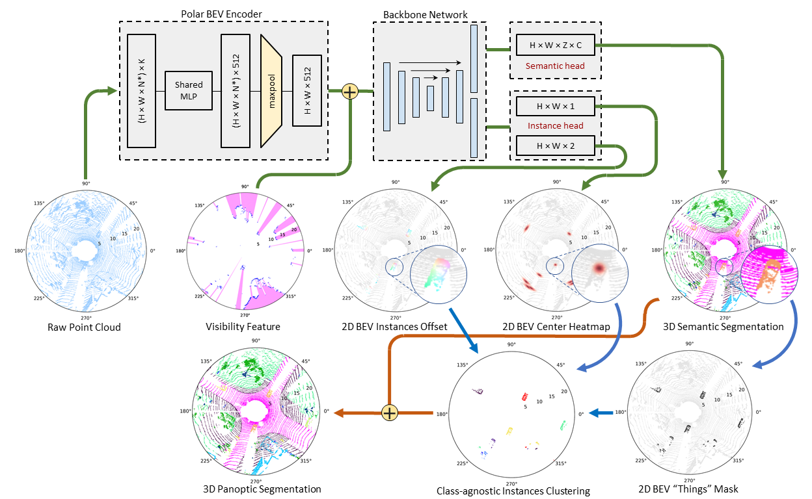
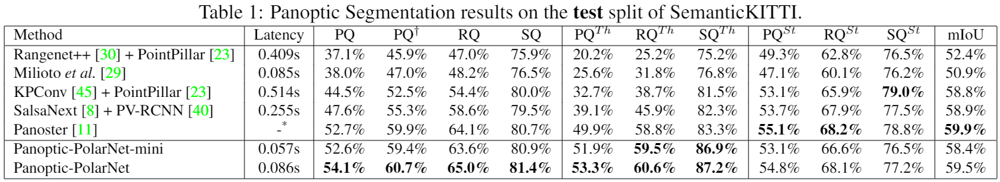

# Panoptic-PolarNet
This is the official implementation of Panoptic-PolarNet.

<p align="center">
         
</p>

# Introduction

Panoptic-PolarNet is a fast and robust LiDAR point cloud panoptic segmentation framework. We learn both semantic segmentation and class-agnostic instance clustering in a single inference network using a polar Bird's Eye View (BEV) representation. Predictions from the semantic and instance head are then fused through a majority voting to create the final panopticsegmentation.

<p align="center">
         
</p>

We test Panoptic-PolarNet on SemanticKITTI and nuScenes datasets. Experiment shows that Panoptic-PolarNet reaches state-of-the-art performances with a real-time inference speed.

<p align="center">
         
</p>


## Prepare dataset and environment

This code is tested on Ubuntu 16.04 with Python 3.8, CUDA 10.2 and Pytorch 1.7.0.

1, Install the following dependencies by either `pip install -r requirements.txt` or manual installation.
* numpy
* pytorch
* tqdm
* yaml
* Cython
* [numba](https://github.com/numba/numba)
* [torch-scatter](https://github.com/rusty1s/pytorch_scatter)
* [dropblock](https://github.com/miguelvr/dropblock)
* (Optional) [open3d](https://github.com/intel-isl/Open3D)

2, Download Velodyne point clouds and label data in SemanticKITTI dataset [here](http://www.semantic-kitti.org/dataset.html#overview).

3, Extract everything into the same folder. The folder structure inside the zip files of label data matches the folder structure of the LiDAR point cloud data.

4, Data file structure should look like this:

```
./
├── train.py
├── ...
└── data/
    ├──sequences
        ├── 00/           
        │   ├── velodyne/	# Unzip from KITTI Odometry Benchmark Velodyne point clouds.
        |   |	├── 000000.bin
        |   |	├── 000001.bin
        |   |	└── ...
        │   └── labels/ 	# Unzip from SemanticKITTI label data.
        |       ├── 000000.label
        |       ├── 000001.label
        |       └── ...
        ├── ...
        └── 21/
	    └── ...
```

5, Instance preprocessing:
```shell
python instance_preprocess.py -d </your data path> -o </preprocessed file output path>
``` 

## Training

Run
```shell
python train.py
```

The code will automatically train, validate and save the model that has the best validation PQ. 

Panoptic-PolarNet with default setting requires around 11GB GPU memory for the training. Training model on GPU with less memory would likely cause GPU out-of-memory. In this case, you can set the ``grid_size`` in the config file to ``[320,240,32]`` or lower.

## Evaluate our pretrained model

We also provide a pretrained Panoptic-PolarNet weight.
```shell
python test_pretrain.py
```
Result will be stored in `./out` folder. Test performance can be evaluated by uploading label results onto the SemanticKITTI competition website [here](https://competitions.codalab.org/competitions/24025).

## Citation